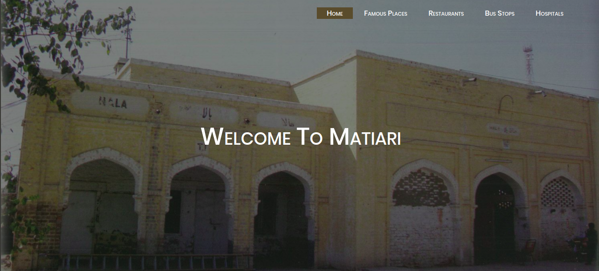

# Tourism Website for Matiari

http://explore-matiari.surge.sh/
### *A Website about Matiari, that contains Information about Matiari, It's History, Restaurants, Famous Places, Famous Things, Bus Stops and Hospitals.*

## Task
Built this app to show Attractions and History of my Village "MATIARI" and to polish my HTML5, CSS3, Javascript-es6, and Web App Development Skills.

## Run Locally 

- Run this command `git clone https://github.com/qjunaid623/matiariWebsite.git`
- You are now in the dev environment and you can play around 

## Tech Stack

- HTML5
- CSS3
- Font Awesome
- VS Code
- Surge
